# RFID-Connector

Der RFID-Connector ermöglicht eine Zeitnahme für z.B. Carrera Hybrid oder Dr!ft von Sturmkind usw. mit <a href="https://www.smartrace.de/">SmartRace</a> oder <a href="https://carrera-hybrid-racing-club.de/">CH-Racing-Club</a>. Hierzu wird bei SmartRace der analoge Sensormodus genutzt. Die Anbindung erfolgt über WLAN. Die Zeitnahme ist aktuell für 8 Autos möglich (8 Controller in SmartRace). 
Des Weiteren können 2 RFID-Ids für einen Controller definiert werden. Somit sind auch Langstreckenrennen mit jeweils zwei Fahrzeugen pro Team möglich.
Der ESP32 geht bei fehlender WLAN-Konfiguration automatisch in einen Accesspoint-Modus.
Über das Webinterface <a href="http://rfid-connector">http://rfid-connector</a> kann der RFID-Connector konfiguriert werden.
Neben SSID und Passwort des zu verwendenden Routers muss die IP-Addresse und der Port des SmartRace-Servers für den analogen Sensorbetrieb gesetzt werden.
Der Power Level für den RFID-Empfang kann von 10dbm bis 26dbm eingestellt werden.
Die Ids der RFID-Chips für Controller 1-8 werden bei neu erkannten IDs automatisch gefüllt, wenn sie im Webinterface zuvor "leer" sind.
Die optionale ID2 pro Controller muss für Team-Rennen im Webinterface ausgefüllt werden.  
Die optionale RFID LED wird mit Anode (+) an 3,3V und Kathode (-) an Pin D2 (ESP32-DEV) bzw. Pin D8 (ESP32-C3) angeschlossen. 
Die optionale WEBSOCKET LED wird mit Anode (+) an 3,3V und Kathode (-) an Pin D4 (ESP32-DEV) bzw. Pin D9 (ESP32-C3) angeschlossen. (Vorwiderstand nicht vergessen oder LED mit eingebautem Widerstand verwenden!)  
Im Quellcode kann die ESP32 Version für den ESP32-C3 über einen define
aktiviert werden. 
Standard ist der ESP32-Dev mit externer Antenne.
<a href="./script-flasher/README.md">Flash-Anleitungen</a>

## Konfiguration über Web-Interface:
<a href="http://rfid-connector">http://rfid-connector</a>  
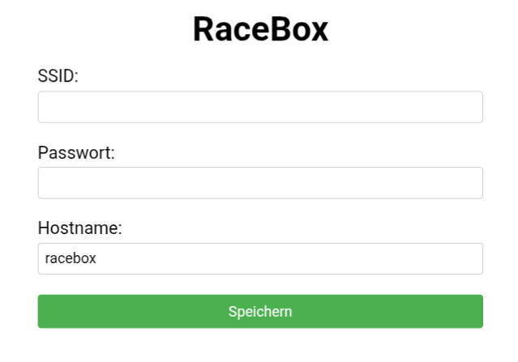 
 
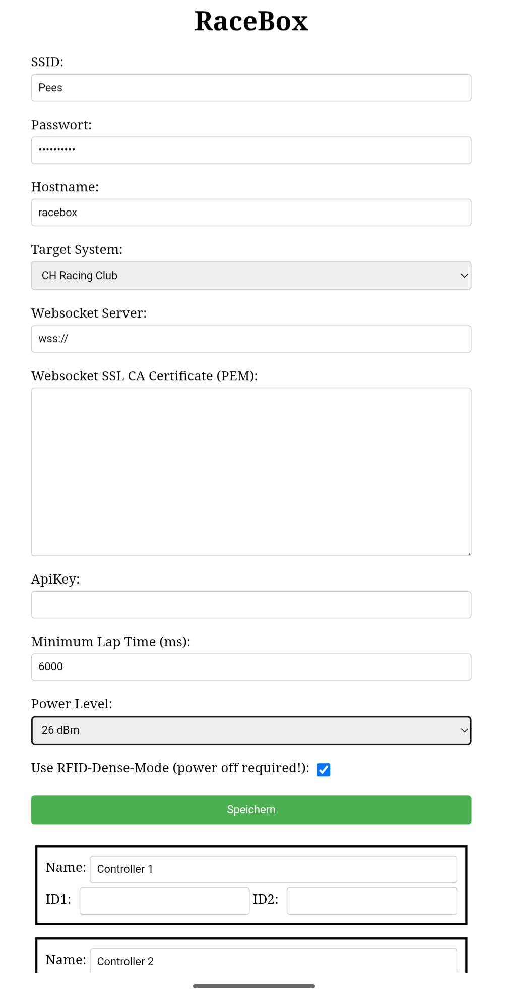
  

Als RFID-Leser wird ein R200 der Firma Inveton verwendet. Dieser kann z.B. über AliExpress bezogen werden und liegt inklusive einer 1dbi Antenne mit Versand aktuell bei ca. 50 Euro. 
Des Weiteren wird ein ESP32 benötigt.
Passende RFID-Aufkleber können bei Amazon bezogen werden.

## Beispielhardware/Bezugsquellen:

AliExpress: (Bitte die richtige Auswahl treffen! Meist ist nur ein Aufklebersatz für unter 10 Euro als default selektiert!) 
Mir ist aktuell keine Bezugsquelle aus Deutschland bekannt. Der Chip selber arbeitet mit in der EU zulässigen RFID-Frequenzen (wurde in der Software konfiguriert).
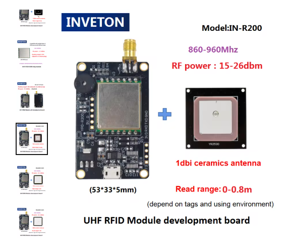
  
ESP32-WROOM-32U mit externem Antennenanschluss: 
https://amzn.eu/d/12kL505
  
kleine RFID-Tags (Carrera Hybrid): 
https://amzn.eu/d/fBFeS80
 Anmerkung: 
Die Tags haben im Auslieferungszustand alle die gleiche ID (EPC). 
Mit Hilfe des Sketches RFID-Label-Writer.ino  kann die ID neu geschrieben werden. Dazu den Sketch auf den ESP32 laden und danach alle Tags einzeln an die Antenne halten. Die ID wird von 1 automatisch hochgezählt. Textausgabe kann über Serial angesehen werden.
  

## Aufbau der Hardware
### Zu verdrahtende Anschlüsse (im Beispiel zusätzlich abgeschirmt): 
R200 5V <--> ESP32 5V 
R200 TX <--> ESP32 GPIO 16 
R200 RX <--> ESP32 GPIO 17 
R200 GND <--> ESP32 GND 
LAP LED (5V oder mit Vorwiderstand) + <--> ESP32 3,3V // Optional 
LAP LED (5V oder mit Vorwiderstand) - <--> ESP32 GPIO 2 (ESP32-DEV) / GPIO 8 (ESP32-C3) //Optional 
WEBSOCKET LED (5V oder mit Vorwiderstand) + <--> ESP32 3,3V // Optional 
WEBSOCKET LED (5V oder mit Vorwiderstand) - <--> ESP32 GPIO 4 (ESP32-DEV) / GPIO 9 (ESP32-C3) //Optional  
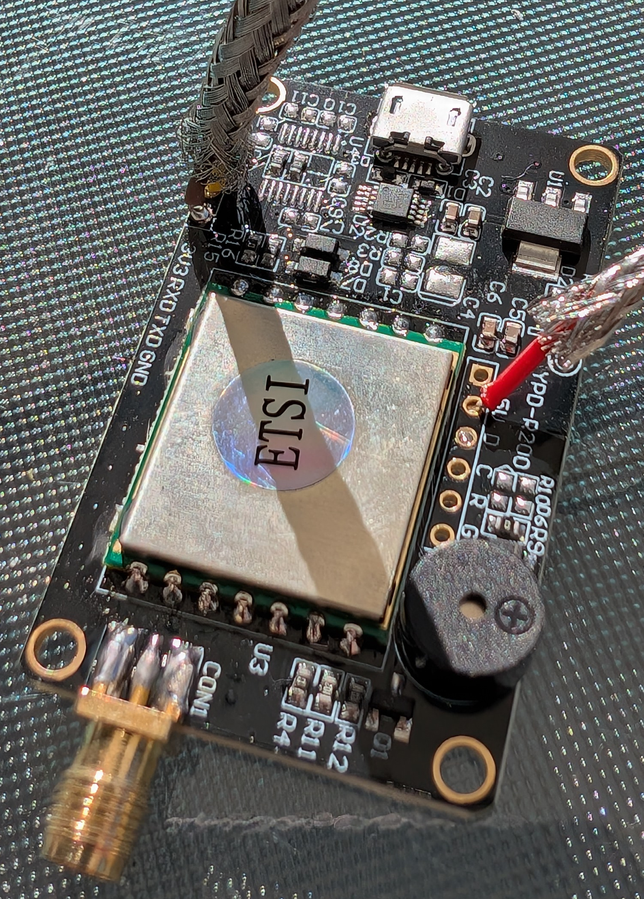

### Der Einbauort für den RFID-Reader wurde mit Alufolie ausgekleidet um Funk-Störungen zu minimieren.  (Es hat sich gezeigt, dass die Abschirmung nicht benötigt wird)
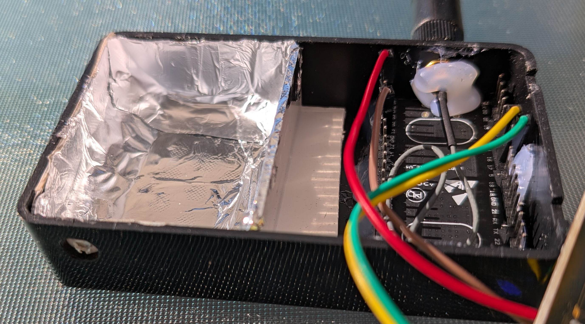

### Montage der 1dbi Antenne als Brücke über Start/Ziel:
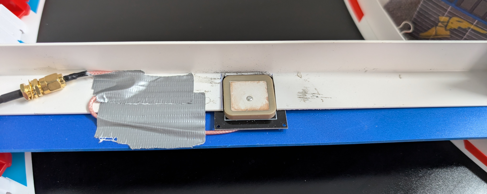
  

### RFID-Reader R200 mit ESP32 und externer Antenne in einem Gehäuse.
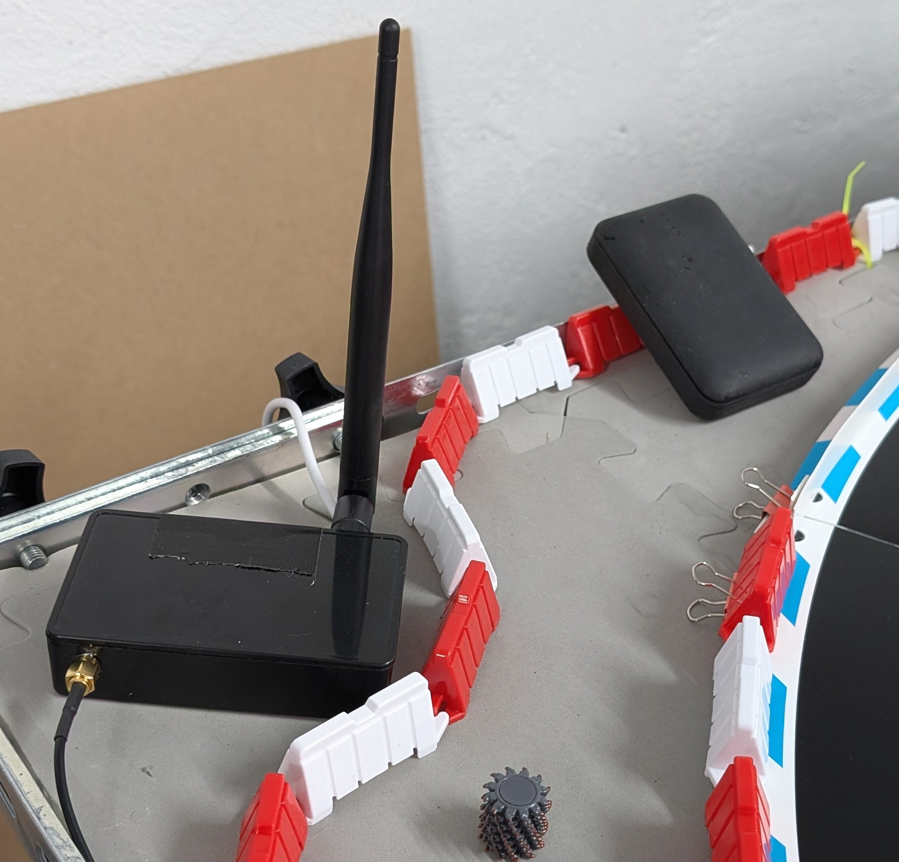

### RFID-Aufkleber unter Carrera Hybrid Fahrzeugen

### Darstellung in SmartRace
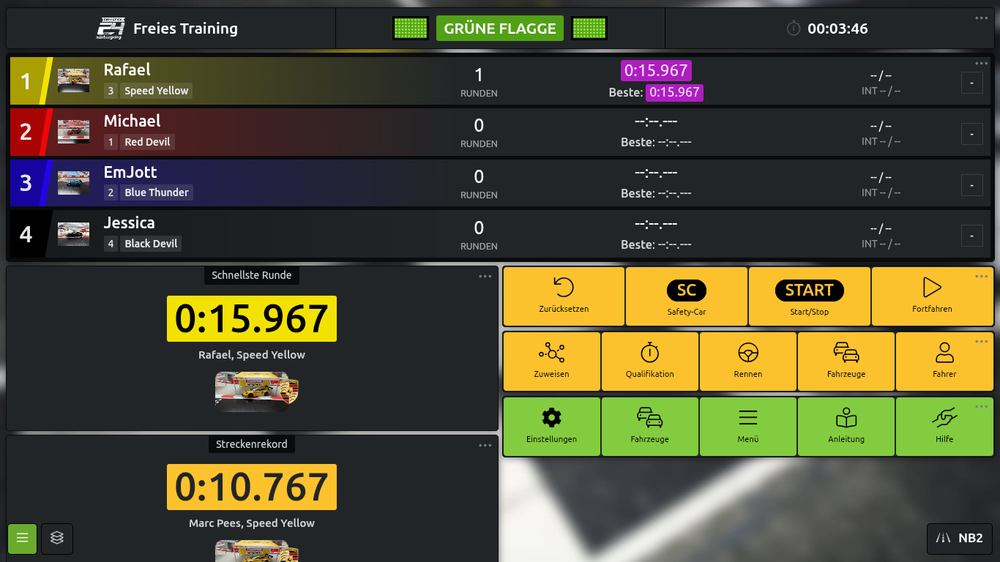

### Version mit ESP32-C3
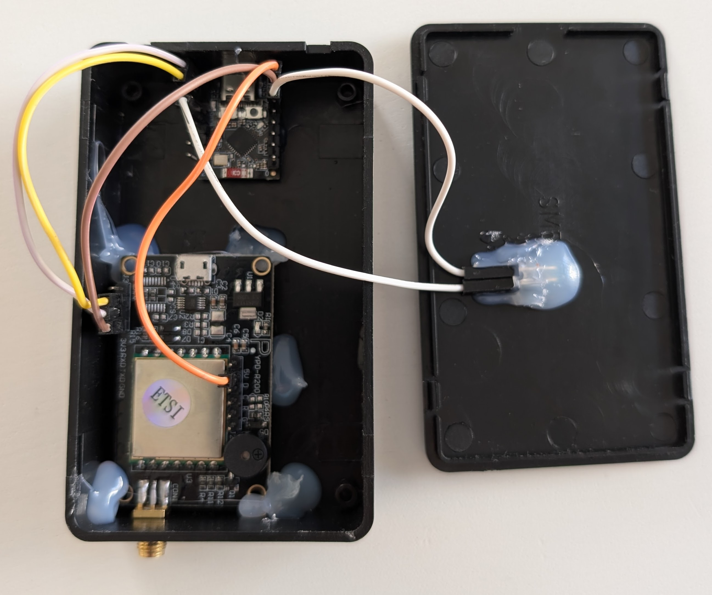
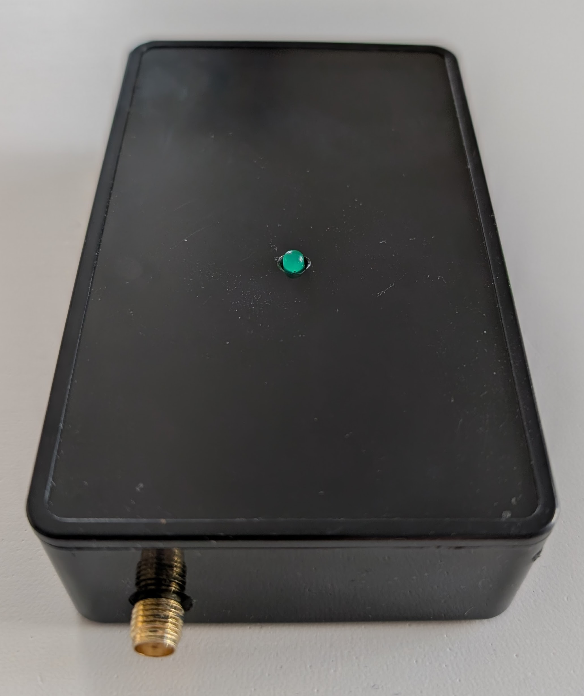
  

# GhostCar
Automatisches Starten/Stoppen des CH-Racers über SmartRace oder CH-Racing-Club.
Es wird ein Game-Controller simuliert, der auf Events von SmartRace oder CH-Racing-Club reagiert. Die eingebaute RGB-LED des ESP32-S3 zeigt den aktiven Modus an.  Während der Startphase wird launch-control automatisch aktiviert.  Der genutzte ESP32-S3 mini kann bei Android Phones direkt als USB-GameController verwendet werden (#define ESP32S3) sowie als Bluetooth GameController für Android und IOs. 
Wird ein ESP32-C3 genutzt so ist nur Bluetooth möglich! 
Die defines können in der config.h entsprechend gesetzt werden. 

Die Konfiguration des GhostCars erfolgt über das Webinterface <a href="http://GhostCar">http://ghostcar</a>
 <a href="./script-flasher/README.md">Flash-Anleitungen</a>  
## Benötigte Hardware

- ESP32-S3 mini (Waveshare) oder ESP32C3 (nur Bluetooth)
- USB-C Stecker auf USB-C Stecker (Duttek-Store) von Amazon
  

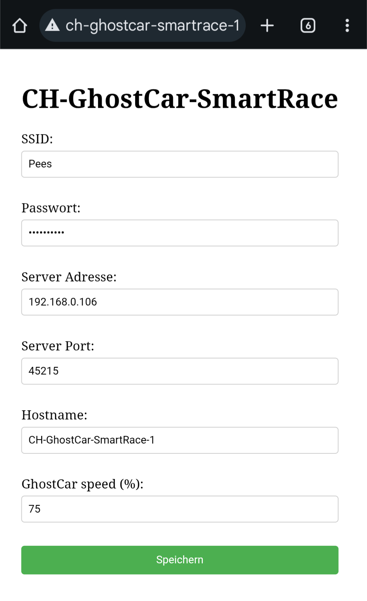
