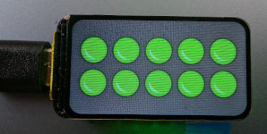

# RaceCollection Überblick

Die **RaceCollection** ist ein System für den Miniatur-Automobilsport, das verschiedene Komponenten zur präzisen Zeiterfassung und Rennsteuerung bietet.

---

### RFID-Connector

Der **RFID-Connector** fungiert als RFID-Empfänger. Er erfasst Fahrzeuge präzise und übermittelt die Zieldurchfahrten an Rennmanagement-Software wie **SmartRace** oder **CH-Racing-Club**.  
<a href="./RFID-Connector/README.md">Zum RFID-Connector</a>

-----

### GhostCar / Startampel-LED mit GhostCar

Diese Komponente bietet eine **GhostCar-Funktion**, bei der Sie gegen einen Carrera Hybrid Racer antreten können. Sie beinhaltet auch eine **Startampel-LED**. Ein zugehöriges Video zeigt das "GhostCar-StartingLights"-System in Aktion mit der "SmartRace"-Software. Es demonstriert den Countdown der Startampel, das "Go"-Signal mit grünen Lichtern, die GhostCar-Funktionalität, die Rundenzeiterfassung und die Rennsteuerung.  
<a href="./GhostCar/README.md">Zum GhostCar</a> 
  

-----

### Startampel Display

Das **Startampel Display** ist eine separate Anzeigeeinheit für die Startampel.  
<a href="./StartingLightsDisplay/README.md">Zur Startampel</a> 
   

