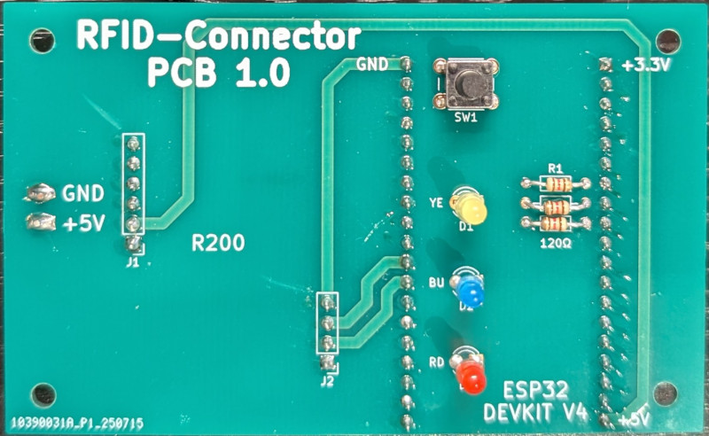
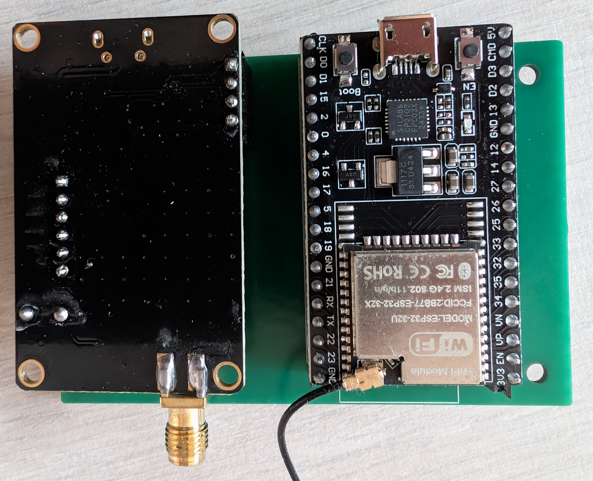
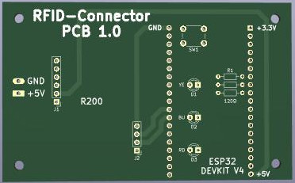
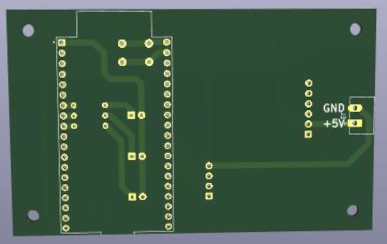

# RFID-Connector

Der RFID-Connector ermöglicht eine Zeitnahme für z.B. Carrera Hybrid oder Dr!ft von Sturmkind usw. mit <a href="https://www.smartrace.de/">SmartRace</a> oder <a href="https://carrera-hybrid-racing-club.de/">CH-Racing-Club</a>. Hierzu wird bei SmartRace der analoge Sensormodus genutzt. Die Anbindung erfolgt über WLAN. Die Zeitnahme ist aktuell für 8 Autos möglich (8 Controller in SmartRace). 
Des Weiteren können 2 RFID-Ids für einen Controller definiert werden. Somit sind auch Langstreckenrennen mit jeweils zwei Fahrzeugen pro Team möglich.
Der ESP32 geht bei fehlender WLAN-Konfiguration automatisch in einen Accesspoint-Modus.
Über das Webinterface <a href="http://rfid-connector">http://rfid-connector</a> kann der RFID-Connector konfiguriert werden.
Zunächst wird die SSID und das Wlan-Passwort des zu verwendenden Routers konfiguriert. Anschließend kann die Websocketaddresse des SmartRace-Servers für den analogen Sensorbetrieb gesetzt werden bzw. der Websocket, Zertifikat und der API-Key für CH-Racing-Club eingegeben werden. Zwischen den Konfigurationen SmartRace/Ch-Racing-Club kann im Anschluß über eine Auswahlbox umgeschaltet werden.
Der Power Level für den RFID-Empfang kann von 10dbm bis 26dbm eingestellt werden.
Die Ids der RFID-Chips für Controller 1-8 werden bei neu erkannten IDs automatisch gefüllt, wenn sie im Webinterface zuvor "leer" sind. Temporäres Zurücksetzten der IDs (bis zum nächsten Reboot) kann bei der Platinenvariante über den Taster erfolgen.
Die optionale ID2 pro Controller muss für Team-Rennen im Webinterface ausgefüllt werden.  

<a href="./script-flasher/README.md">Flash-Anleitungen</a>

Als RFID-Leser wird ein R200 der Firma Inveton verwendet. Dieser kann z.B. über AliExpress bezogen werden und liegt inklusive einer 1dbi Antenne mit Versand aktuell bei ca. 50 Euro. 
Des Weiteren wird ein ESP32 benötigt.
Passende RFID-Aufkleber können bei Amazon bezogen werden.

## Beispielhardware/Bezugsquellen:

AliExpress: (Bitte die richtige Auswahl treffen! Meist ist nur ein Aufklebersatz für unter 10 Euro als default selektiert!) 
Mir ist aktuell keine Bezugsquelle aus Deutschland bekannt. Der Chip selber arbeitet mit in der EU zulässigen RFID-Frequenzen (wurde in der Software konfiguriert).

  
ESP32-WROOM-32U mit externem Antennenanschluss: 
https://amzn.eu/d/12kL505
  
kleine RFID-Tags (Carrera Hybrid): 
https://amzn.eu/d/fBFeS80
 Anmerkung: 
Die Tags haben im Auslieferungszustand alle die gleiche ID (EPC). 
Mit Hilfe des Sketches RFID-Label-Writer.ino  kann die ID neu geschrieben werden. Dazu den Sketch auf den ESP32 laden und danach alle Tags einzeln an die Antenne halten. Die ID wird von 1 automatisch hochgezählt. Textausgabe kann über Serial angesehen werden.
  

## Aufbau/Verdrahtung ohne Platine (ESP32-DEV)
R200 5V <--> ESP32 5V 
R200 TX <--> ESP32 GPIO 16 
R200 RX <--> ESP32 GPIO 17 
R200 GND <--> ESP32 GND  
optionale RFID LED:  
Der Anschluss der RFID LED erfolgt mit Anode (+) an 3,3V und Kathode (-) über Vorwiderstand an Pin 2 (ESP32-DEV).  
optionale WEBSOCKET LED 
Der Anschluss der WEBSOCKET LED erfolgt mit Anode (+) an 3,3V und Kathode (-) über Vorwiderstand an Pin 4 (ESP32-DEV).   
optionale WIFI AP-Mode LED 
Der Anschluss der WIFI AP-Mode LED erfolgt mit Anode (+) an 3,3V und Kathode (-) über Vorwiderstand an Pin 25 (ESP32-DEV).  
optinaler Taster: 
Der Taster wird an GND und Pin 23 (ESP32-DEV) angeschlossen. 

## Verwendung Adapter-Platine (Plug & Play): 
 Prototyp: 

 Finale Platine 1.0 

## Montage der 1dbi Antenne als Brücke über Start/Ziel:

## RFID-Aufkleber unter Carrera Hybrid Fahrzeugen

## Darstellung in SmartRace

