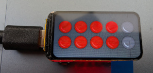
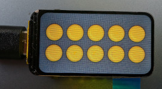

### StartingLightsDisplay

Eine optisch ansprechende Startampel, einfach zu bauen, basierend auf einem ESP32-C6 mit kleinem Display. Inklusive Werbebannern im Idle-Modus.  Die Konfiguration des GhostCars erfolgt über das Webinterface <a href="http://starting-lights">http://starting-lights</a>  
<a href="./script-flasher/README.md">Flash-Anleitungen</a>    
