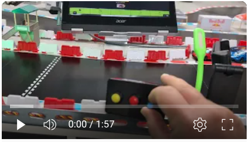
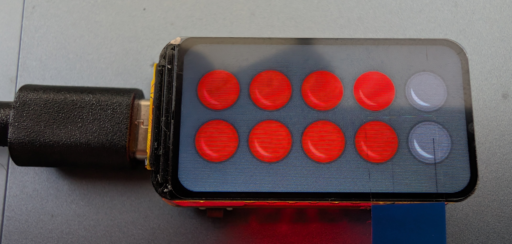
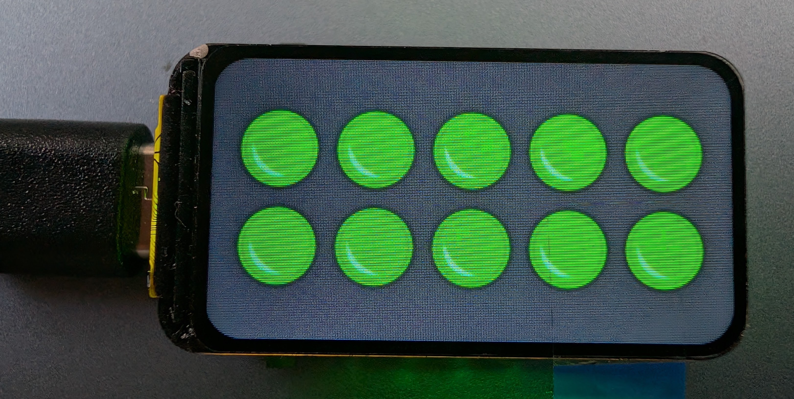
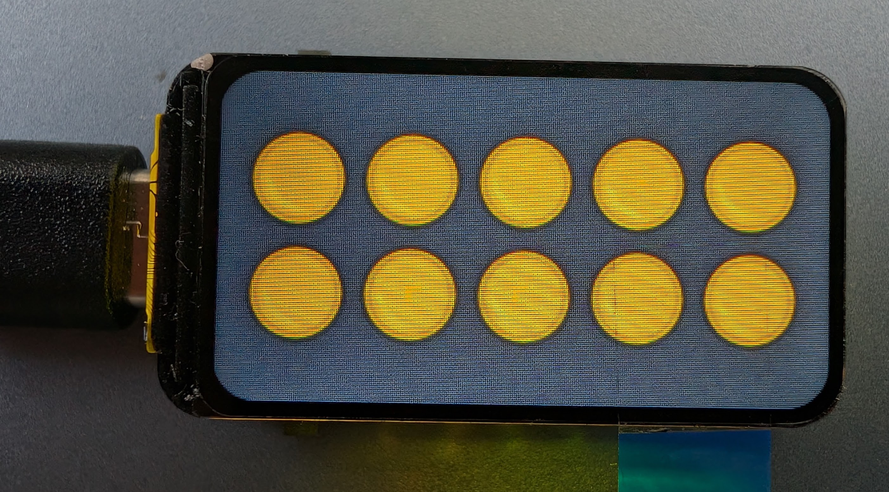

# RaceBox Skript-Flasher

Willkommen beim RaceBox Skript-Flasher\! Hier finden Sie die Firmware für Ihre RaceBox-Geräte. Das Flashen der unterstützten ESP32-Geräte ist einfach: Laden Sie die entsprechende Zip-Datei herunter ("<i>Download raw file</i>") und führen Sie das enthaltene Skript aus. Der Flasher unterstützt **Windows** und **Linux**.

Eine detaillierte Anleitung für den Flash-Vorgang unter Windows finden Sie hier: [Anleitung Windows](../dev-tools/github-workflow-files/flasher/windows/README.md). Diese Anleitung ist auch in jeder Flasher-Zip-Datei enthalten.

-----

## Verfügbare "Boxen"

Hier eine Übersicht der verschiedenen RaceBox-Firmware-Versionen:

### RaceBox

Die **RaceBox** ist Ihr RFID-Empfänger zur präzisen Erfassung von Fahrzeugen und zur Übertragung der Zieldurchfahrten an SmartRace oder CH-Racing-Club.
[RaceBox-ESP32-DEV.zip](./RaceBox-ESP32-DEV.zip)

-----

### RaceBox-GhostCar

Verwandeln Sie ein Fahrzeug in ein Geisterauto\!

#### Für ESP32-S3 (Bluetooth-GhostCar und USB-GhostCar)

  * **Ohne Poti:** ESP32-S3 ohne zusätzliche Verdrahtung oder nur mit Start/Stop-Taster.
    [RaceBox-GhostCar-ESP32-S3-NoPoti.zip](./RaceBox-GhostCar-ESP32-S3-NoPoti.zip)   
  * **Mit Poti:** ESP32-S3 mit Potentiometer zur Geschwindigkeitsanpassung und optionalem Start/Stop-Taster.
    [RaceBox-GhostCar-ESP32-S3-Poti.zip](./RaceBox-GhostCar-ESP32-S3-Poti.zip)

#### Für ESP32-C3 (Nur Bluetooth-GhostCar)

  * **Ohne Poti:** ESP32-C3 ohne zusätzliche Verdrahtung oder nur mit Start/Stop-Taster.
    [RaceBox-GhostCar-ESP32-C3-NoPoti.zip](./RaceBox-GhostCar-ESP32-C3-NoPoti.zip)
  * **Mit Poti:** ESP32-C3 mit Potentiometer zur Geschwindigkeitsanpassung und optionalem Start/Stop-Taster.
    [RaceBox-GhostCar-ESP32-C3-Poti.zip](./RaceBox-GhostCar-ESP32-C3-Poti.zip)

-----

### RaceBox-GhostCar-StartingLights

Diese Version kombiniert das GhostCar mit einer Startampel. **Benötigt 20 WS2812B LEDs\!** Die Ampel ist in 4 Reihen zu je 5 LEDs angeordnet. Eine Platine zur einfacheren Montage (aktuell nur CNC-Fräsdaten) wird nachgereicht. Unterstützt SmartRace sowie CH-Racing-Club.

#### Für ESP32-S3 (Startampel + Bluetooth-GhostCar + USB-GhostCar)

  * **Ohne Poti:** ESP32-S3 mit Startampel, optionalen Start/Stop-Tastern, aber ohne Potentiometer zur Geschwindigkeitsanpassung.
    [RaceBox-GhostCar-StartingLights-ESP32-S3-NoPoti.zip](./RaceBox-GhostCar-StartingLights-ESP32-S3-NoPoti.zip)
  * **Mit Poti:** ESP32-S3 mit Startampel, Potentiometer zur Geschwindigkeitsanpassung und optionalen Start/Stop-Tastern.
    [RaceBox-GhostCar-StartingLights-ESP32-S3-Poti.zip](./RaceBox-GhostCar-StartingLights-ESP32-S3-Poti.zip)    

#### Für ESP32-C3 (Startampel + Bluetooth-GhostCar)

  * **Ohne Poti:** ESP32-C3 mit Startampel, optionalen Start/Stop-Tastern, aber ohne Potentiometer zur Geschwindigkeitsanpassung.
    [RaceBox-GhostCar-StartingLights-ESP32-C3-NoPoti.zip](./RaceBox-GhostCar-StartingLights-ESP32-C3-NoPoti.zip)
  * **Mit Poti:** ESP32-C3 mit Startampel, Potentiometer zur Geschwindigkeitsanpassung und optionalen Start/Stop-Tastern.
    [RaceBox-GhostCar-StartingLights-ESP32-C3-Poti.zip](./RaceBox-GhostCar-StartingLights-ESP32-C3-Poti.zip)    

-----

### RaceBox-StartingLightsDisplay

Eine optisch ansprechende Startampel, einfach zu bauen, basierend auf einem ESP32-C6 mit kleinem Display. Inklusive Werbebannern im Idle-Modus.
[RaceBox-StartingLightsDisplay-ESP32-C6.zip](./RaceBox-StartingLightsDisplay-ESP32-C6.zip)    

-----

### RFID-Label-Writer

Mit dem **RFID-Label-Writer** können Sie neue RFID-Tags mit einer einmalig neuen ID beschreiben. Die Firmware kann temporär auf die RaceBox aufgespielt werden. Ziehen Sie anschließend alle Tags **nacheinander** einmal über die Antenne. Die IDs werden ab 1 mit jedem Tag hochgezählt und sind somit eindeutig.

**Wichtig:** Bei einem Neustart der Box beginnt der Schreibvorgang wieder bei 1\!
[RFID-Label-Writer-ESP32-DEV.zip](./RFID-Label-Writer-ESP32-DEV.zip)

-----